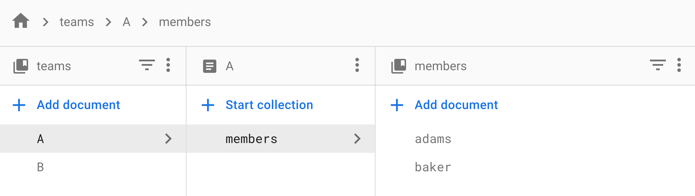

この例では、複数ドキュメントに渡るサブコレクションを一括で取得するための Hooks を作成します。

次のようなデータ構造を例に考えてみましょう、同じコレクション内に A と B の 2 つのドキュメントが存在しています。
それぞれのドキュメントはサブコレクションとして `members` を持っています。

```
─── teams
    ├── A
    │   └── members
    │       ├── adams
    │       └── baker
    ├── B
    │   └── members
    │       ├── clark
    │       └── davis
```



# Hooks の雛形を作成

Hooks の引数を考えてみましょう。サブコレクションを取得するために必要な項目は次の 2 つです。

- コレクションのパス（例：`/teams`）
- サブコレクションの名称（例：`members`）

```js
function useSubCollection(collectionPath, subCollectionName) {
  // Code
}
```

# サブコレクションのパスを取得

コレクション `teams` に含まれるドキュメントを取得し、
取得したドキュメント ID からサブコレクションのパスを取得します。

```js
const [collection] = useGetCollection(collectionPath);
const docIds = collection.map(doc => doc.id);
const subCollectionPaths = docIds.map(id => path.resolve(collectionPath, id, subCollectionName));
```

`collection` は次のようになります。

```js
[
  {
    id: "A",
    data: { ... }
  },
  {
    id: "B",
    data: { ... }
  }
]
```

サブコレクションの取得には `id` の部分のみを使用します。
`subCollectionPaths` は次のようになります。

```js
["/teams/A/members", "/teams/B/members"];
```

# サブコレクションのそれぞれのドキュメントを取得

上記ではサブコレクションのパスを配列の形で取得することができました。
次はこのパスを使用して、それぞれのコレクションを取得しましょう。

このような配列に対応するクエリを行いたい場合は `useArrayQuery` を使用します。
`useArrayQuery` には次のような FQL を渡します。

```js
{
  queries: [
    {
      location: "path/to/doc/in/firestore",
    },
    {
      location: "path/to/doc/in/firestore",
    },
  ];
}
```

上記で作成した `subCollectionPaths` をこの FQL の形式に合わせます。

```js
const fql = {
  queries: subCollectionPaths.map(subCollectionPath => ({ location: subCollectionPath })),
};
```

これを `useArrayQuery` に渡してそれぞれのコレクションを取得しましょう。

```js
const [subCollection] = useArrayQuery(fql);
```

`subCollection` は次のようになります。

```js
[
  [
    {
      data: { ... },
      id: "adams",
    },
    {
      data: { ... },
      id: "baker",
    },
  ],
  [
    {
      data: { ... },
      id: "clark",
    },
    {
      data: { ... },
      id: "davis",
    },
  ],
];
```

このままでは `[Aのサブコレクション, Bのサブコレクション]` という形になっているので、配列を 2 次元から 1 次元に変換しましょう。

```js
const flatten = Array.prototype.concat.apply([], subCollection);
```

`flatten` は次のようになります。

```js
[
  {
    data: { ... },
    id: "adams",
  },
  {
    data: { ... },
    id: "baker",
  },
  {
    data: { ... },
    id: "clark",
  },
  {
    data: { ... },
    id: "davis",
  },
];
```

# Hooks の戻り値を決める

戻り値を指定しましょう。取得したデータだけを返すのであれば、次のようにすることができます。

```js
return [flatten];
```

しかし、これでは `loading` や `error` を返していないので、データを読み込み中なのかエラーが発生したのか、View 側から判断することはできません。
そのため、途中で使用した `useGetCollection` と `useArrayQuery` の `loading` と `error` を戻り値に含めましょう。

先程のコードを一部修正します。

```js
const [collection, colLoading, colError] = useGetCollection(collectionPath);
```

```js
const [subCollection, subColLoading, subColError] = useArrayQuery(fql);
```

戻り値は次のようにすることができます。

```js
const loading = colLoading || subColLoading;
const error = colError !== null ? colError : subColError;
return [flatten, loading, error];
```

# 完成形

今回作成したカスタム Hooks は次のようになります。

```js
function useSubCollection(collectionPath, subCollectionName) {
  // サブコレクションのパスを取得
  const [collection, colLoading, colError] = useGetCollection(collectionPath);
  const docIds = collection.map(doc => doc.id);
  const subCollectionPaths = docIds.map(id => path.resolve(collectionPath, id, subCollectionName));

  // サブコレクションのそれぞれのドキュメントを取得
  const fql = {
    queries: subCollectionPaths.map(subCollectionPath => ({ location: subCollectionPath })),
  };
  const [subCollection, subColLoading, subColError, subColReloadFn] = useArrayQuery(fql);
  const flatten = Array.prototype.concat.apply([], subCollection);

  const loading = colLoading || subColLoading;
  const error = colError !== null ? colError : subColError;
  return [flatten, loading, error];
}
```

コンポーネント側からは次のようにして呼び出すことができます。

```js
const [members, loading, error] = useSubCollection("/teams", "members");
return (
  <>
    <pre>{loading ? "Loading ..." : JSON.stringify(members, null, 4)}</pre>
    <pre>{error && JSON.stringify(error)}</pre>
  </>
);
```

また、今回の内容と同じ機能をもった Hooks が `useGetSubCollection` という名称で Fireclient に組み込まれているので、
ライブラリをインストールしてすぐに試すことができます。
