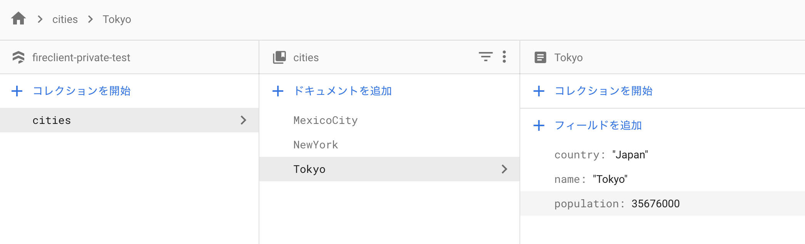

# 前準備

## Firestore の環境構築

Firestore にアクセスできる環境を作成します。もし既にテストできるような環境があれば、このステップをスキップしてください。
Firebase プロジェクトを作成しましょう。[こちら](https://firebase.google.com/?hl=ja)からプロジェクトの作成を行ってください。

プロジェクトの作成が完了したら、トップページから「ウェブアプリに Firebase を追加」を行います。
追加が完了したら「Firebase SDK の追加」の部分でスクリプトが表示されます。

`firebaseConfig`の箇所を使用するので、コピーしておきます。

```js
var firebaseConfig = {
  apiKey: "xxxxxxxxxxxxxxxxxxxxxxxxxxxxxxxxxxxxxxx",
  authDomain: "xxxxxxxxxxxxxxxxxxxxxxx.firebaseapp.com",
  databaseURL: "https://xxxxxxxxxxxxxxxxxxxxxxx.firebaseio.com",
  projectId: "xxxxxxxxxxxxxxxxxxxxxxx",
  storageBucket: "xxxxxxxxxxxxxxxxxxxxxxx.appspot.com",
  messagingSenderId: "xxxxxxxxxxxx",
  appId: "x:xxxxxxxxxxxx:web:xxxxxxxxxxxxxxxxxxxxxx",
};
```

次に、Firestore の初期化を行います。サイドバーから `開発` > `Database` へ移動し、データベースの作成を行います。
ここで、セキュリティルールの設定はテストモードに切り替えることを推奨します。

データベースの作成が完了したら、テスト用のデータを登録しておきましょう。
`cities`というコレクションを作成し、`Tokyo`, `NewYork`, `MexicoCity` というドキュメントを登録します。

また、それぞれのフィールド（`population`など）も登録しておきます。
最終的に次のようなデータ構造になります。

```
─── cities
    ├── MexicoCity
    │   ├── country: "Mexico"
    │   ├── name: "Mexico City"
    │   └── population: 19028000
    ├── NewYork
    │   ├── country: "United States"
    │   ├── name: "New York"
    │   └── population: 19354922
    └── Tokyo
        ├── country: "Japan"
        ├── name: "Tokyo"
        └── population: 35676000
```



## React プロジェクトの作成

React プロジェクトを作成しましょう。

React に慣れていなければ、[Create-React-App](https://ja.reactjs.org/docs/create-a-new-react-app.html#create-react-app) などで作成することを推奨します。

## パッケージのインストール

`TODO: Github からのインストールを NPM サーバーからに変更する`

`npm`または`yarn`コマンドでパッケージをインストールします。

```sh
# NPM
npm install --save https://github.com/Optimind-llc/fire-client.git
# Yarn
yarn add https://github.com/Optimind-llc/fire-client.git
```

# Provider の設置

Fireclient が提供する `Provider` というコンポーネントにより、子コンポーネントが Fireclient の機能にアクセスすることができるようになります。

また、`Provider`には Firestore のデータベースを渡す必要もあるので、Firebase の初期化も合わせて行います。

```js
// src/index.js
import React from "react";
import ReactDOM from "react-dom";
import App from "./App";

import firebase from "firebase";
import { Provider } from "react-fireclient";

const firebaseConfig = {
  apiKey: "xxxxxxxxxxxxxxxxxxxxxxxxxxxxxxxxxxxxxxx",
  authDomain: "xxxxxxxxxxxxxxxxxxxxxxx.firebaseapp.com",
  databaseURL: "https://xxxxxxxxxxxxxxxxxxxxxxx.firebaseio.com",
  projectId: "xxxxxxxxxxxxxxxxxxxxxxx",
  storageBucket: "xxxxxxxxxxxxxxxxxxxxxxx.appspot.com",
  messagingSenderId: "xxxxxxxxxxxx",
  appId: "x:xxxxxxxxxxxx:web:xxxxxxxxxxxxxxxxxxxxxx",
};
firebase.initializeApp(firebaseConfig);
const db = firebase.firestore();

ReactDOM.render(
  <Provider firestoreDB={db}>
    <App />
  </Provider>,
  document.getElementById("root")
);
```

# Hooks を使う

`useGetDoc`を使って、先程登録した Firestore 上のデータを読み取って見ましょう。
`useGetDoc`に、対象のドキュメントのパスを渡します。

注意：Firestore のパスは`/Collection/Doc/Collection/Doc/...`となっていることに注意してください。
Collection のデータを取得したい場合、代わりに`useGetCollection`を使用します。

```js
// src/App.js
import React from "react";
import { useGetDoc } from "react-fireclient";

function App() {
  const path = "/cities/Tokyo";
  const [data, loading, error] = useGetDoc(path);
  return <pre>{JSON.stringify(data)}</pre>;
}

export default App;
```

アプリを実行すると次のように表示されます。
先ほど Firestore に登録した内容が React 上で取得できていることが分かります。

```
{
  data: {"country":"Japan","name":"Tokyo","population":35676000},
  id: "Tokyo"
}
```
